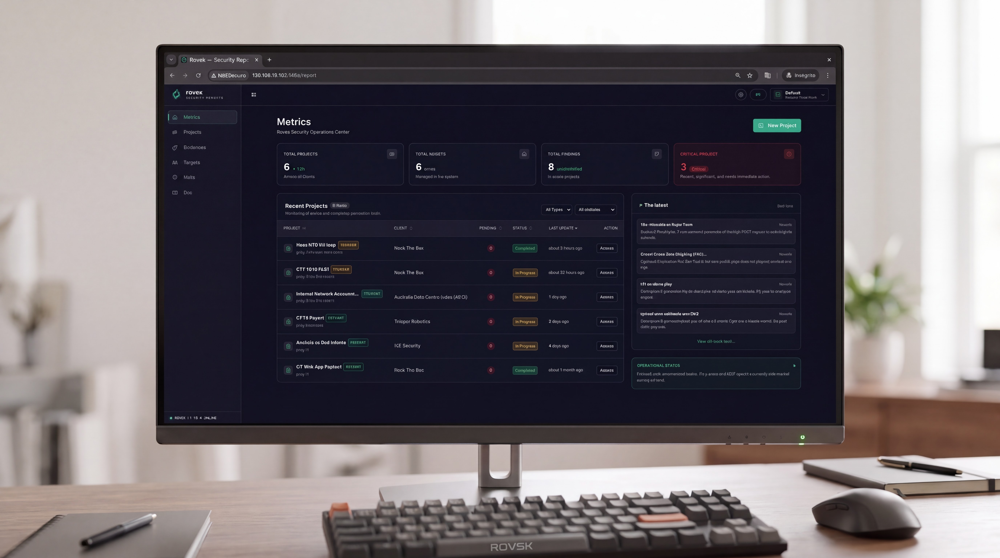
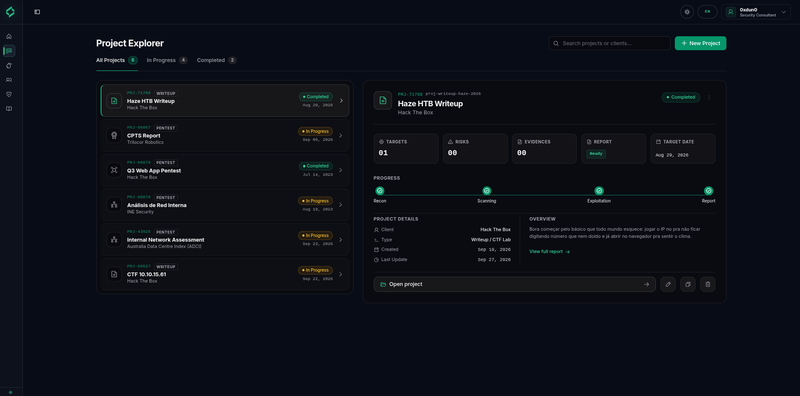
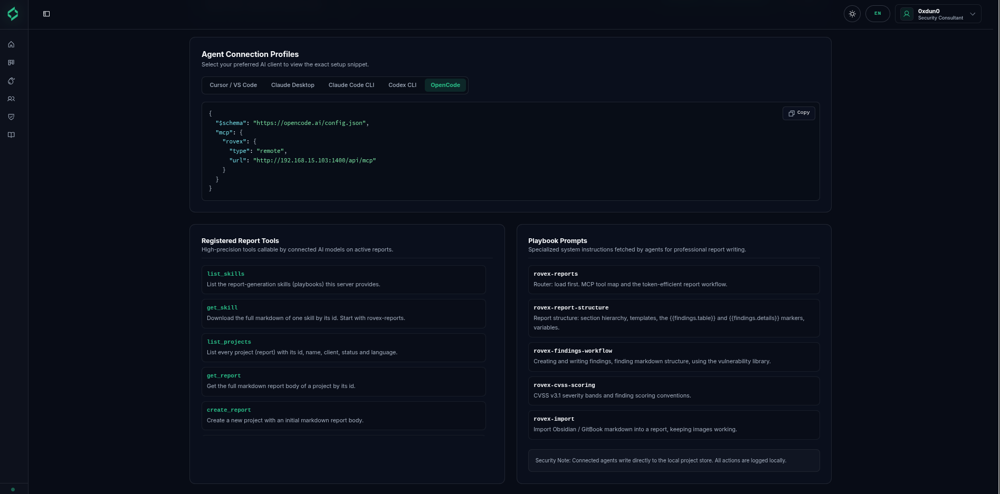

<div align="center">

# ROVEX

### Plataforma Soberana de Segurança Ofensiva & Relatórios Executivos
### Sovereign Offensive Security Reporting & Vulnerability Management
### Plataforma Soberana de Seguridad Ofensiva & Gestión de Informes

[](CHANGELOG.md)
[](LICENSE)
[](https://nextjs.org/)
[](https://react.dev/)
[](https://nodejs.org/)
[](https://modelcontextprotocol.io/)
[](#)

<br />

<!-- Hero Banner Principal -->


<br /><br />

<!-- Layout Dual com Duas Fotos Lado a Lado -->
<table border="0" width="100%" cellspacing="0" cellpadding="4">
  <tr>
    <td width="50%" align="center" valign="top">
      
      <br />
      <sub><b>Project Explorer</b> — Navegação Master-Detail minimalista, painel contextual de métricas e filtros por tipo.</sub>
    </td>
    <td width="50%" align="center" valign="top">
      
      <br />
      <sub><b>AI Native (MCP Server)</b> — Conexão direta com agentes autônomos (Claude Code, Cursor, OpenCode) para relatórios em streaming.</sub>
    </td>
  </tr>
</table>

<br />

**[Documentação Técnica Completa / Full Technical Documentation](doc/README.md)** &bull; **[Hub Interativo no App (Doc)](http://127.0.0.1:1400/report/e3b8a1c9f4d27e5a)**

</div>

---

## Índice / Table of Contents / Índice General

1. [🇧🇷 Português (Brasil)](#-português-brasil)
   - [Visão Geral](#visão-geral)
   - [Destaques da Plataforma](#destaques-da-plataforma)
   - [Arquitetura & IA Nativa (MCP)](#arquitetura--ia-nativa-mcp)
   - [Instalação & Execução Rápida](#instalação--execução-rápida)
2. [🇺🇸 English](#-english)
   - [System Overview](#system-overview)
   - [Key Highlights](#key-highlights)
   - [Architecture & Native AI (MCP)](#architecture--native-ai-mcp)
   - [Quick Start & Deployment](#quick-start--deployment)
3. [🇪🇸 Español](#-español)
   - [Visión General](#visión-general)
   - [Capacidades Principais](#capacidades-principais)
   - [Arquitectura e IA Nativa (MCP)](#arquitectura-e-ia-nativa-mcp)
   - [Instalación & Inicio Rápido](#instalación--inicio-rápido)

---

## 🇧🇷 Português (Brasil)

### Visão Geral

O **Rovex** é uma estação soberana e gratuita de engenharia de relatórios de pentest e gerenciamento de vulnerabilidades, projetada para consultorias de segurança ofensiva, red teams e pesquisadores independentes.

Diferente de soluções corporativas pagas ou plataformas em nuvem que impõem taxas recorrentes por assento e colocam dados confidenciais de clientes em servidores de terceiros, o Rovex opera sob a premissa de **privacidade absoluta (100% Local-First)**, execução rápida em container único ou binário Node.js local, e compilação de alta fidelidade para **Word (`.docx`) nativo, PDF para impressão via CSS paged `@page`, HTML autocontido e Markdown limpo**.

### Destaques da Plataforma

- **Privacidade Soberana & Zero Telemetria**: Todos os relatórios, evidências fotográficas, credenciais e escopos de clientes permanecem estritamente dentro da sua infraestrutura.
- **Editor Markdown por Seções**: Modos `Split`, `MD` e `Preview` com redimensionamento dinâmico e suporte completo a fórmulas e variáveis de modelo.
- **Rastreador Nativo de Tarefas `[TODO: ...]`**: Identificação visual instantânea de itens pendentes no relatório com âncoras diretas para a seção correspondente.
- **Calculadora Automatizada CVSS v3.1**: Cálculo vetorial oficial de pontuação base, impacto e exploitabilidade com matrizes visuais de severidade.
- **Exportadores de Documentos de Alto Padrão**:
  - **Word Corporativo (`.docx`)**: Compilação AST OOXML nativa com capa executiva, sumário automático e chips coloridos de severidade.
  - **PDF Executivo**: Regras paged `@page` A4 com controle de quebra de página e numeração dinâmica de rodapés.
  - **HTML Autocontido**: Arquivo único com estilos embutidos pronto para apresentação ao cliente.
- **Servidor MCP Nativo (Model Context Protocol)**: Conexão direta com assistentes de IA (Claude Code, Cursor, OpenCode) via endpoint HTTP de streaming.
- **Central Técnica de Documentação (`Doc`)**: Hub interativo no menu lateral com paleta rápida de busca `⌘`, dicionário de variáveis de interpolação e guias operacionais.

### Arquitetura & IA Nativa (MCP)

O Rovex adota uma arquitetura de **Monólito Modular Moderno** em Next.js 15 e React 19, garantindo latência zero na escrita e eliminação de sobrecargas de microsserviços.

O servidor MCP expõe cinco habilidades modulares sob demanda para economia de contexto dos modelos LLM:
- `rovex-reports`: Roteamento mestre e ciclo de auditoria.
- `rovex-report-structure`: Gramática de seções e tags de interpolação `{{findings.table}}` e `{{findings.details}}`.
- `rovex-findings-workflow`: Estruturação de vulnerabilidades e anexação de evidências.
- `rovex-cvss-scoring`: Convenções de pontuação CVSS v3.1.
- `rovex-import`: Migração de anotações do Obsidian e GitBook com imagens preservadas.

### Instalação & Execução Rápida

```bash
# 1. Clonar o repositório
git clone https://github.com/0xdun0/rovex.git
cd rovex

# 2. Instalar dependências com pnpm
pnpm install

# 3. Iniciar o ambiente de desenvolvimento
pnpm dev

# Acesse no navegador:
# - Local: http://127.0.0.1:1400
# - Rede / Host IP: http://<seu-ip-local>:1400 (ex: http://192.168.15.103:1400)
```

Execução alternativa via script orquestrador:
```bash
python3 app.py
```

---

## 🇺🇸 English

### System Overview

**Rovex** is a sovereign, self-hosted, and free security reporting and vulnerability management platform tailored for offensive security consultants, enterprise red teams, and ethical hackers.

Unlike proprietary cloud platforms that enforce per-seat subscription models and transfer sensitive vulnerability proof-of-concepts to external clouds, Rovex guarantees **strict local-first data isolation**, ultra-fast single-process execution, and publication-grade export to **Word (`.docx`) with native OOXML tables, paged PDF (`@page`), standalone single-file HTML, and GitHub-Flavored Markdown**.

### Key Highlights

- **Local-First & Zero Telemetry**: Confidential audit findings, target scopes, and proof-of-concept captures never leave your premises.
- **Sectional Block Markdown Editor**: Flexible `Split` / `MD` / `Preview` editing with live table of contents and draggable split-pane dividers.
- **Uppercase `[TODO: ...]` Tracking**: Active tasks are highlighted across editor sections and report preview panels with auto-scroll anchors.
- **Automated CVSS v3.1 Vector Engine**: Exact mathematical computation of base severity, exploitability, and impact metrics with radar distributions.
- **Multi-Format Publication Exporters**:
  - **Native Word (`.docx`)**: Custom AST compiler building native tables of contents, branded covers, and vector severities.
  - **Printable PDF**: High-precision `@page` CSS styling with automated running headers and footers.
  - **Client HTML**: Standalone distributable client deliverable with integrated theme styles.
- **Native MCP (Model Context Protocol) Server**: Connect coding assistants (Claude Code, Cursor, OpenCode) directly via `POST /api/mcp` for autonomous reporting.
- **Interactive Documentation Hub**: Built-in `Doc` module with quick Command shortcut palette `⌘`, variable interpolation dictionary, and operational teardowns.

### Architecture & Native AI (MCP)

Built as a **Modern Modular Monolith** on Next.js 15, React 19, and Node.js 22 to ensure instant rendering without distributed network partitions.

Connect your AI agent via MCP:
```bash
# Claude Code CLI
claude mcp add --transport http rovex http://127.0.0.1:1400/api/mcp

# OpenCode CLI
opencode mcp add rovex --url http://127.0.0.1:1400/api/mcp
```

### Quick Start & Deployment

```bash
# 1. Clone repository
git clone https://github.com/0xdun0/rovex.git
cd rovex

# 2. Install dependencies
pnpm install

# 3. Launch platform
pnpm dev

# Navigate in your browser:
# - Localhost: http://127.0.0.1:1400
# - Network / Host LAN IP: http://<your-local-ip>:1400 (e.g. http://192.168.15.103:1400)
```

---

## 🇪🇸 Español

### Visión General

**Rovex** es una plataforma soberana, gratuita y autoalojada para la redacción de informes de pentest y la gestión estructurada de vulnerabilidades, creada para consultores de ciberseguridad ofensiva, equipos de red team y auditores de seguridad.

A diferencia de soluciones comerciales cerradas que exigen cuotas mensuales por usuario y transfieren evidencias críticas a servidores externos, Rovex asegura **privacidad estricta y almacenamiento 100% local**, ejecución ágil sin telemetría y compilación a **Word (`.docx`) nativo, PDF paginado para impresión con `@page`, HTML independiente y Markdown estándar**.

### Capacidades Principais

- **Cero Telemetría y Máxima Confidencialidad**: Los datos de clientes, capturas técnicas y vectores de ataque permanecen bajo tu exclusivo control.
- **Editor Markdown por Secciones**: Modos de visualización `Split`, `MD` y `Preview` con divisores ajustables y resolución inmediata de variables.
- **Seguimiento Integrado de Tareas `[TODO: ...]`**: Resaltado visual en rojo de elementos pendientes con navegación directa al bloque editable.
- **Motor de Puntuación CVSS v3.1**: Cálculo exacto de métricas vectoriales y generación automática de tablas resumen de hallazgos.
- **Exportación Multi-Formato Profesional**:
  - **Microsoft Word (`.docx`)**: Generador OOXML con portada corporativa, índice nativo y chips cromáticos de criticidad.
  - **PDF Ejecutivo**: Regras CSS `@page` tamaño A4 con separación rigurosa de páginas y numeración corrida.
  - **HTML Autocontenido**: Documento ejecutable en cualquier navegador sin dependencias de red.
- **Servidor MCP Nativo**: Interfaz estándar de Model Context Protocol para asistir en la redacción con agentes de IA autónomos.
- **Centro de Documentación Técnica (`Doc`)**: Buscador rápido con atajo Command `⌘`, referencia completa de campos de interpolación y manuales de arquitectura.

### Arquitectura e IA Nativa (MCP)

Diseñado como un **Monolito Modular Moderno** con Next.js 15, React 19 y TypeScript para ofrecer tiempos de respuesta ultrarrápidos.

Configuración en clientes con soporte HTTP MCP:
```jsonc
{
  "mcpServers": {
    "rovex": {
      "url": "http://127.0.0.1:1400/api/mcp"
    }
  }
}
```

### Instalación & Inicio Rápido

```bash
# 1. Clonar el repositorio
git clone https://github.com/0xdun0/rovex.git
cd rovex

# 2. Instalar dependencias con pnpm
pnpm install

# 3. Iniciar servidor local
pnpm dev

# Abrir en el navegador:
# - Local: http://127.0.0.1:1400
# - Red / Host IP: http://<tu-ip-local>:1400 (ej: http://192.168.15.103:1400)
```

---

<div align="center">
  <sub>Desenvolvido com excelência por <b>0xdun0</b> &bull; Rovex Offensive Security Suite</sub>
</div>
