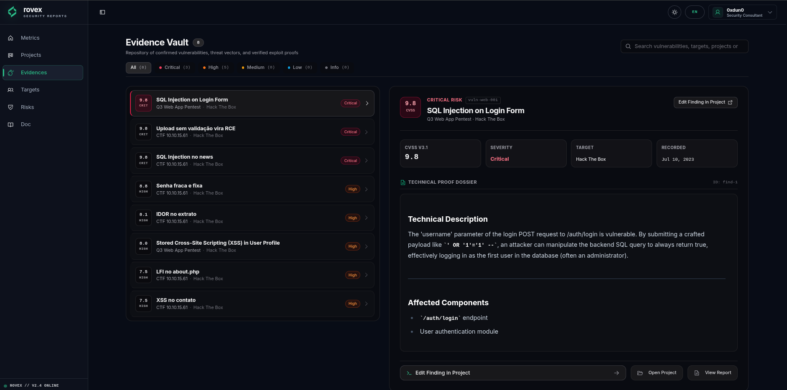
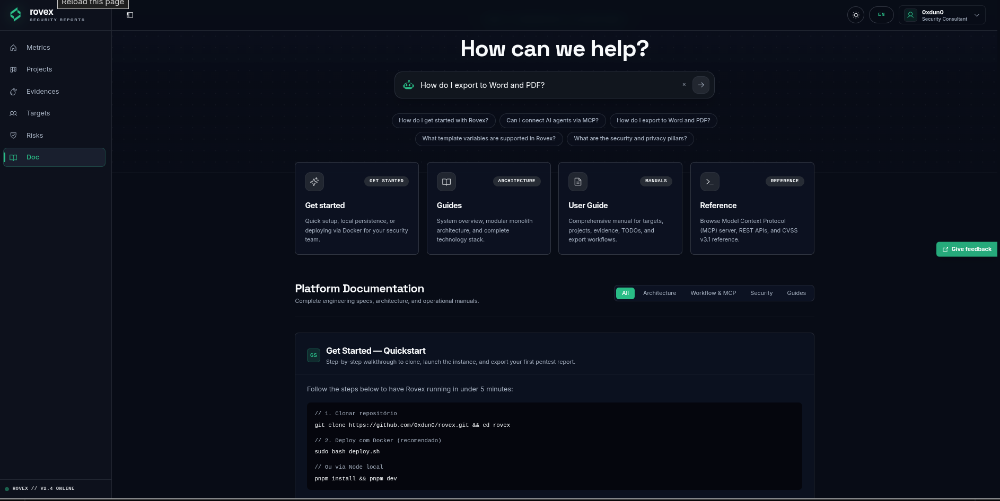

<div align="center">

# ROVEX

### Plataforma Soberana de Segurança Ofensiva & Relatórios Executivos
### Sovereign Offensive Security Reporting & Vulnerability Management
### Plataforma Soberana de Seguridad Ofensiva & Gestión de Informes

[](CHANGELOG.md)
[](LICENSE)
[](https://nextjs.org/)
[](https://react.dev/)
[](https://nodejs.org/)
[](https://modelcontextprotocol.io/)
[](#)

<br />

<!-- Hero Banner Principal -->


<br /><br />

<!-- Grid 2x2 com 4 Capturas Principais -->
<table border="0" width="100%" cellspacing="0" cellpadding="6">
  <tr>
    <td width="50%" align="center" valign="top">
      
      <br />
      <sub><b>Project Explorer</b> — Navegação Master-Detail minimalista, painel contextual de métricas e filtros por tipo.</sub>
    </td>
    <td width="50%" align="center" valign="top">
      
      <br />
      <sub><b>Evidence Vault</b> — Catálogo de vulnerabilidades com trilho lateral de telemetria CVSS v3.1 e preview Markdown.</sub>
    </td>
  </tr>
  <tr>
    <td width="50%" align="center" valign="top">
      
      <br />
      <sub><b>AI Native (MCP Server)</b> — Conexão direta com agentes autônomos (Claude Code, Cursor, OpenCode) para relatórios em streaming.</sub>
    </td>
    <td width="50%" align="center" valign="top">
      
      <br />
      <sub><b>Documentation Hub</b> — Central técnica integrada na interface com busca rápida Command ⌘ e blueprints.</sub>
    </td>
  </tr>
</table>

<br />

**[Documentação Técnica Completa / Full Technical Documentation](doc/README.md)** &bull; **[Hub Interativo no App (Doc)](http://127.0.0.1:1400/report/e3b8a1c9f4d27e5a)**

</div>

---

## Índice / Table of Contents / Índice General

1. [🇧🇷 Português (Brasil)](#-português-brasil)
   - [Visão Geral](#visão-geral)
   - [Principais Recursos](#principais-recursos)
   - [Instalação & Execução Rápida](#instalação--execução-rápida)
2. [🇺🇸 English](#-english)
   - [System Overview](#system-overview)
   - [Key Highlights](#key-highlights)
   - [Quick Start & Deployment](#quick-start--deployment)
3. [🇪🇸 Español](#-español)
   - [Visión General](#visión-general)
   - [Capacidades Principales](#capacidades-principales)
   - [Instalación & Inicio Rápido](#instalación--inicio-rápido)

---

## 🇧🇷 Português (Brasil)

### Visão Geral

O **Rovex** é uma plataforma soberana e gratuita de geração de relatórios de pentest e writeups, com gerenciamento integrado de vulnerabilidades. Projetada para consultorias de segurança ofensiva, red teams e pesquisadores independentes, opera em modelo **100% Local-First e zero telemetria**: seus achados, evidências e relatórios nunca saem da sua rede.

### Principais Recursos

- **Pentests & Writeups**: Suporte nativo aos dois fluxos de trabalho com templates dedicados e identificadores semânticos padronizados.
- **Privacidade Soberana & Zero Telemetria**: Execução ágil em container único ou binário Node.js local, sem envio de dados a nuvens externas.
- **Editor Markdown por Seções**: Modos `Split`, `MD` e `Preview` com redimensionamento dinâmico e rastreador ativo de tarefas `[TODO: ...]`.
- **Calculadora Automatizada CVSS v3.1**: Cálculo vetorial oficial de pontuação base, impacto e exploitabilidade com matrizes visuais de severidade.
- **Exportação Multi-Formato Profissional**:
  - **Word Corporativo (`.docx`)**: Compilação AST OOXML nativa com capa executiva, sumário dinâmico e tabelas nativas.
  - **PDF Executivo**: Regras CSS `@page` tamanho A4 com controle rigoroso de quebras de página.
  - **HTML Autocontido & Markdown**: Arquivo único com estilos embutidos pronto para apresentação ao cliente.
- **IA Nativa (MCP Server)**: Servidor HTTP integrado com 14 ferramentas operacionais e 5 playbooks sob demanda (`rovex-reports`, `structure`, `findings`, `cvss`, `import`) para Claude Code, Cursor e OpenCode gerarem relatórios completos.
- **Central Técnica de Documentação (`Doc`)**: Hub interativo com paleta rápida de busca Command `⌘`, dicionário de variáveis e guias de arquitetura.

### Instalação & Execução Rápida

```bash
# 1. Clonar o repositório
git clone https://github.com/0xdun0/rovex.git
cd rovex

# 2. Instalar dependências com pnpm
pnpm install

# 3. Iniciar o ambiente de desenvolvimento
pnpm dev

# Acesse no navegador:
# - Local: http://127.0.0.1:1400
# - Rede / Host IP: http://<seu-ip-local>:1400 (ex: http://192.168.15.103:1400)
```

Execução alternativa via script orquestrador:
```bash
python3 app.py
```

---

## 🇺🇸 English

### System Overview

**Rovex** is a sovereign, free, and self-hosted platform for generating pentest reports and technical writeups, featuring integrated vulnerability management. Designed for offensive security consultancies, red teams, and independent researchers, it operates strictly **100% Local-First with zero telemetry**: your findings, proof-of-concepts, and client scopes never leave your network.

### Key Highlights

- **Pentests & Writeups**: Dedicated workflows for commercial engagements and CTF/lab writeups with standardized semantic IDs.
- **Strict Data Sovereignty**: Ultra-fast single-process execution (Node.js or Docker) with zero external cloud dependencies.
- **Sectional Markdown Block Editor**: `Split`, `MD`, and `Preview` modes with draggable dividers and uppercase `[TODO: ...]` tracking anchors.
- **Automated CVSS v3.1 Engine**: Official vector math calculating base, impact, and exploitability scores in real-time.
- **Multi-Format Publication Exporters**:
  - **Native Word (`.docx`)**: Custom AST OOXML engine with executive cover, live table of contents, and styled vulnerability tables.
  - **Printable PDF**: High-precision `@page` A4 styling with automated running headers and page numbers.
  - **Standalone HTML & Markdown**: Single self-contained file with embedded styles ready for client presentation.
- **Native AI (MCP Server)**: Integrated streamable HTTP endpoint exposing 14 operational tools and 5 on-demand playbooks for autonomous LLM report authoring (Claude Code, Cursor, OpenCode).
- **Interactive Documentation Hub (`Doc`)**: Built-in reference portal with quick Command `⌘` search, variable interpolation schemas, and architectural blueprints.

### Quick Start & Deployment

```bash
# 1. Clone repository
git clone https://github.com/0xdun0/rovex.git
cd rovex

# 2. Install dependencies
pnpm install

# 3. Launch platform
pnpm dev

# Navigate in your browser:
# - Localhost: http://127.0.0.1:1400
# - Network / Host LAN IP: http://<your-local-ip>:1400 (e.g. http://192.168.15.103:1400)
```

---

## 🇪🇸 Español

### Visión General

**Rovex** es una plataforma soberana y gratuita de generación de informes de pentest y writeups técnicos, con gestión integrada de vulnerabilidades. Diseñada para consultoras de ciberseguridad ofensiva, red teams y auditores independientes, opera bajo el principio de **privacidad absoluta (100% Local-First y cero telemetría)**: los hallazgos críticos, capturas y credenciales nunca salen de tu red.

### Capacidades Principales

- **Pentests & Writeups**: Flujos de trabajo específicos para auditorías comerciales y writeups de laboratorios/CTF con IDs estandarizados.
- **Privacidad Soberana**: Ejecución ágil en contenedor único o binario Node.js local sin dependencias en la nube.
- **Editor Markdown por Secciones**: Modos `Split`, `MD` y `Preview` con divisores ajustables y seguimiento activo de tareas `[TODO: ...]`.
- **Motor de Puntuación CVSS v3.1**: Cálculo vectorial oficial de severidad base, impacto y explotabilidad en tiempo real.
- **Exportación Multi-Formato Profesional**:
  - **Microsoft Word (`.docx`)**: Compilador AST OOXML con portada ejecutiva, índice nativo y tablas con estilo corporativo.
  - **PDF Ejecutivo**: Regras CSS `@page` tamaño A4 con salto de página controlado y numeración corrida.
  - **HTML Autocontenido & Markdown**: Documento único con estilos integrados listo para entrega al cliente.
- **Servidor MCP Nativo**: Conexión HTTP directa con 14 herramientas y 5 manuales modulares para redacción con agentes de IA (Claude Code, Cursor, OpenCode).
- **Centro Técnico de Documentación (`Doc`)**: Buscador rápido con atajo Command `⌘`, referencia de variables y guías de arquitectura.

### Instalación & Inicio Rápido

```bash
# 1. Clonar el repositorio
git clone https://github.com/0xdun0/rovex.git
cd rovex

# 2. Instalar dependencias con pnpm
pnpm install

# 3. Iniciar servidor local
pnpm dev

# Abrir en el navegador:
# - Local: http://127.0.0.1:1400
# - Red / Host IP: http://<tu-ip-local>:1400 (ej: http://192.168.15.103:1400)
```

---

<div align="center">
  <sub>Desenvolvido com excelência por <b>0xdun0</b> &bull; Rovex Offensive Security Suite</sub>
</div>
