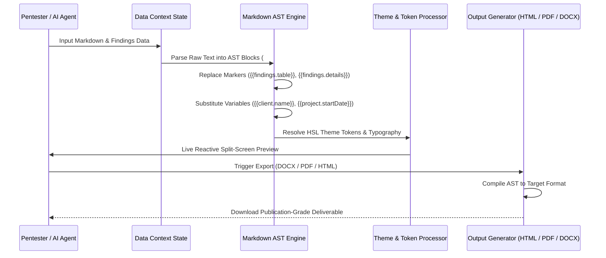

# 03. Data Flow & Components — Rovex

This document details the lifecycle of security data inside Rovex: from the moment findings and evidence enter the platform, through AST compilation and rendering, to AI agent collaboration via the Model Context Protocol (MCP).

---

## 1. Data Ingestion (How Cybersecurity Information Arrives)

Security information enters Rovex through three primary pathways:

```
+--------------------------------------------------------------------------+
|                        Data Ingestion Channels                           |
+--------------------------------------------------------------------------+
       |                                |                            |
       v                                v                            v
 [Interactive UI]             [Template / Seed Engine]       [Native MCP Server]
 - Pentester manual input      - +100 Built-in CWE/WSTG       - AI Agents (Claude Code,
 - Section markdown editor       vulnerabilities               Cursor, OpenCode)
 - Image cropper & evidence    - Pre-built assessment         - Direct API manipulation
   drag-and-drop                 templates (CPTS, Web App)     via POST /api/mcp
```

1. **Interactive Auditor Workflow**:
   - The consultant registers targets, creates an assessment project, and drafts content using the sectional block editor.
   - Evidence files (terminal outputs, proof-of-concept scripts, HTTP request/response dumps) are pasted directly into Markdown code blocks or uploaded via the image picker into IndexedDB.
2. **Template & Seed Ingestion**:
   - Standardized vulnerability definitions are imported from the built-in vulnerability library (+100 entries covering OWASP Top 10, Active Directory attack paths, privilege escalation primitives, and web application flaws).
   - Project templates (such as the CPTS certification template) inject predefined section structures, scopes, methodology descriptions, and `[TODO]` placeholders.
3. **AI-Driven MCP Ingestion**:
   - External security AI agents push findings and report sections programmatically using structured JSON tool invocations over the MCP HTTP transport.

---

## 2. Internal Processing & Rendering Pipeline

Once data enters Rovex, it travels through an orchestrated transformation pipeline before appearing on screen or in exported documents:



### Key Stages in the Pipeline:
1. **Sectional Block Splitting**:
   - The raw Markdown text is parsed into logical blocks based on `#` (Level 1) and `##` (Level 2) headings.
   - Deeper headings (`###`, `####`) remain nested within their parent block. This preserves granular editability without fragmenting the report into micro-paragraphs.
2. **Dynamic Marker Resolution**:
   - `{{findings.table}}`: Replaced at render time with an interactive summary table of all project vulnerabilities sorted by CVSS severity descending.
   - `{{findings.details}}`: Injects the complete detailed proof-of-concept bodies of each finding in place. If absent, the renderer automatically compiles findings into a standardized `# Findings` section at the end.
3. **Template Variable Interpolation**:
   - Variables like `{{client.name}}`, `{{project.startDate}}`, `{{pentester.name}}`, and `{{vulnerabilities.count|critical}}` are resolved dynamically against active project state.
4. **Theme Injection**:
   - Active palette channels (`--primary`, `--background`, `--card`, `--severity-critical`, etc.) and Google Font link tags are calculated by `theme-to-css.ts` and injected into the document scope.

---

## 3. Virtual Assistant & AI Integration (Model Context Protocol)

Rovex features an embedded **Model Context Protocol (MCP)** server exposed at `POST /api/mcp`, built to the official specification.

### How the AI Assistant Accesses Information
Unlike naive implementations that dump an entire 50-page report into the LLM context window on every prompt, Rovex implements a **token-efficient on-demand skill architecture**:

```
+--------------------------------------------------------------------------+
|                     Rovex MCP Server Architecture                        |
+--------------------------------------------------------------------------+
                                    |
            +-----------------------+-----------------------+
            |                                               |
  [On-Demand Skills (Prompt/Doc)]               [CRUD Tool Suite]
  - rovex-reports (Master Router)               - list_projects / create_report
  - rovex-report-structure (Hierarchy & Markers) - get_report / update_report
  - rovex-findings-workflow (Evidence & Proofs)  - list_findings / create_finding
  - rovex-cvss-scoring (CVSS 3.1 Bands)          - update_finding / delete_finding
  - rovex-import (Obsidian/GitBook Migration)   - list_vulnerabilities / get_vulnerability
```

1. **Discovery Handshake**:
   - When an AI agent (Claude Code, Cursor, or OpenCode) initializes an MCP connection, Rovex returns minimal instructions pointing to the `list_skills` and `get_skill` tools.
2. **Selective Playbook Retrieval**:
   - If the AI needs to draft technical findings, it fetches `rovex-findings-workflow`.
   - If it needs to calculate scores, it calls `get_skill("rovex-cvss-scoring")`.
   - This keeps token consumption minimal while equipping the AI with exact formatting rules.
3. **Direct State Synchronization**:
   - AI actions directly mutate the persisted state file (`./data/rovex-state.json`). When the user reloads or views their dashboard, all AI additions appear instantaneously in the native interface.
